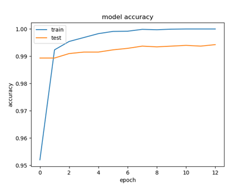
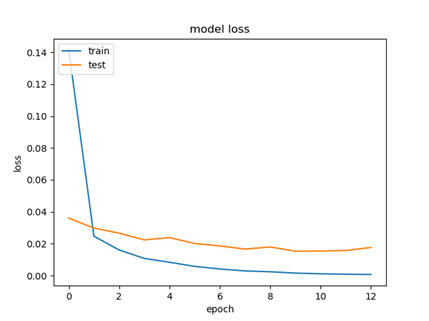
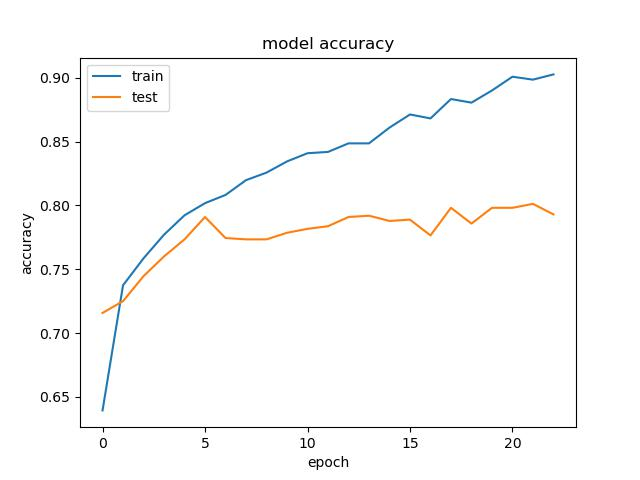
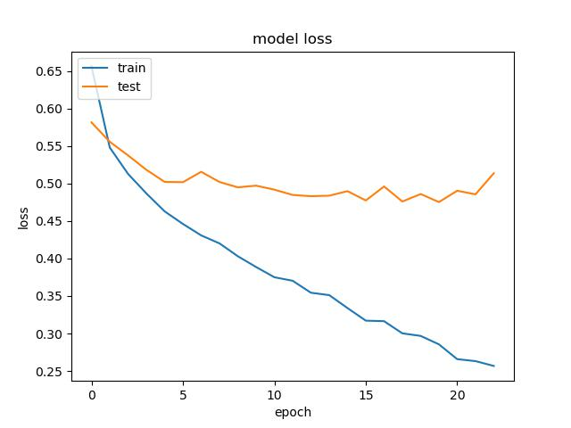
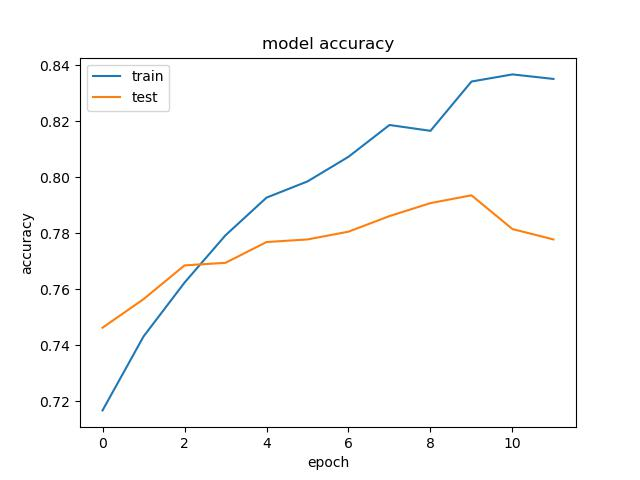
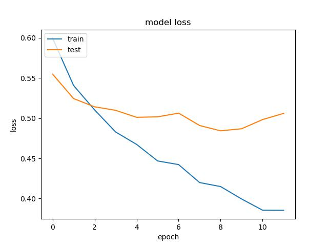
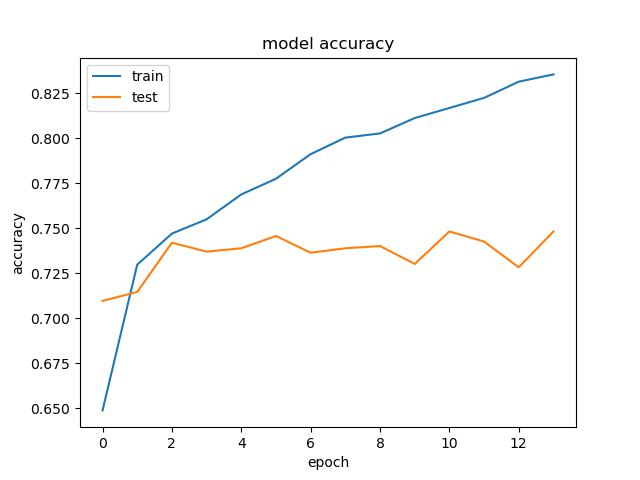
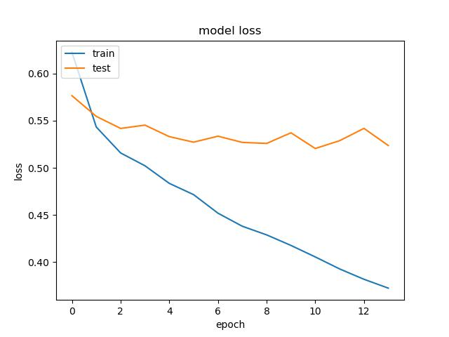

# Bone-Fracture-Detection
## Introduction
In recent years, multiple research has applied machine learning algorithms, such as convolutional neural networks (CNNs), to detect objects in images and videos. Our research involves the detection of bone fractures in a given x-ray image. Various architectures of CNNs, including Classic CNN, VGG, ResNet, and DenseNet, have been used in our research to determine what is the best model that can satisfy our research goals. The results we present in this phase, which were obtained by applying various algorithms to determine the best architecture, indicate significant levels of accuracy in identifying fractures and classifying different types of bone tissue, with some architecture having sensitivity and specificity of over 80% and others that failed those tasks. After researching and reviewing the result of each architecture separately, we found out that the ResNet50 model has given the best results in terms of performance, achieving state-of-the-art results in bone fracture detection and bone part classification on the MURA dataset. These findings demonstrate the potential for machine learning algorithms to be used as an effective tool in the early detection and diagnosis of bone fractures

## Dataset
The data set we used called MURA and included 3 different bone parts, MURA is a dataset of musculoskeletal radiographs and contains 20,335 images described below:

| **Part**     | **Normal** | **Fractured** | **Total** |
|--------------|:----------:|--------------:|----------:|
| **Elbow**    |    3160    |          2236 |      5396 |
| **Hand**     |    4330    |          1673 |      6003 |
| **Shoulder** |    4496    |          4440 |      8936 |
The data is separated into train and valid where each folder contains a folder of a patient and for each patient between 1-3 images for the same bone part

## Algorithm
Our data contains about 20,000 x-ray images, including three different types of bones - elbow, hand, and shoulder. After loading all the images into data frames and assigning a label to each image, we split our images into 72% training, 18% validation and 10% test. The algorithm starts with data augmentation and pre-processing the x-ray images, such as flip horizontal. The second step uses a ResNet50 neural network to classify the type of bone in the image. Once the bone type has been predicted, A specific model will be loaded for that bone type prediction from 3 different types that were each trained to identify a fracture in another bone type and used to detect whether the bone is fractured.
This approach utilizes the strong image classification capabilities of ResNet50 to identify the type of bone and then employs a specific model for each bone to determine if there is a fracture present. Utilizing this two-step process, the algorithm can efficiently and accurately analyze x-ray images, helping medical professionals diagnose patients quickly and accurately.
The algorithm can determine whether the prediction should be considered a positive result, indicating that a bone fracture is present, or a negative result, indicating that no bone fracture is present. The results of the bone type classification and bone fracture detection will be displayed to the user in the application, allowing for easy interpretation.
This algorithm has the potential to greatly aid medical professionals in detecting bone fractures and improving patient diagnosis and treatment. Its efficient and accurate analysis of x-ray images can speed up the diagnosis process and help patients receive appropriate care.

## Results
### Body Part Prediction
 

### Fracture Prediction
#### Elbow
 

#### Hand
 

#### Shoulder
 
